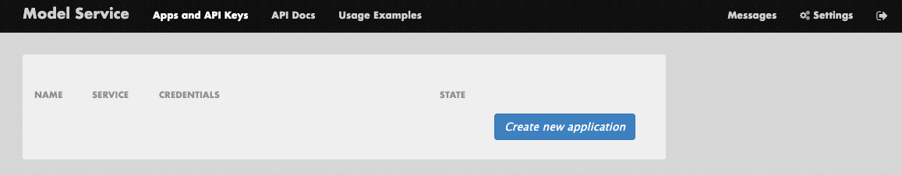

# Access & Usage Information

## Basic Information

### Model Server URL

The model server API can be accessed at: https://ollama-route-ollama.apps.rosa.redhat-ai-dev.m6no.p3.openshiftapps.com/v1

## Authentication

In order to gain access to the model server you will need to sign in with your SSO credentials by selecting Google auth. Once you have signed in you are able to generate a token by navigating to **`Apps and API Keys`** on the top ribbon and hitting **`Create new Application`**:



Select `ollama` as the service. Once a token has been generated, you will be provided with the API server URL.

## API Schema
<!--
The name of the api, model-service-api, is grabbed from the name field in the ai-catalog.yaml metadata for the api.

We can use absolute paths to navigate the TechDocs to reference other resources/components/apis
-->
The API Schema is available [here](/catalog/default/api/ollama-service-api/definition).

## Usage Examples

### IBM Granite-20B-Code-Instruct

#### Text Generation

##### Using Curl

```
curl -X 'POST' \
    'https://ollama-route-ollama.apps.rosa.redhat-ai-dev.m6no.p3.openshiftapps.com/v1/completions' \
    -H 'accept: application/json' \
    -H 'Content-Type: application/json' \
    -d '{
    "model": "ibm-granite-8b-code-instruct",
    "prompt": "San Francisco is a",
    "max_tokens": 15,
    "temperature": 0
}'
```

##### Python

```python
import requests
import urllib3
import numpy as np
import json

API_URL = "https://ollama-route-ollama.apps.rosa.redhat-ai-dev.m6no.p3.openshiftapps.com"
API_KEY = "sk-no-key-required"

input = ["San Francisco is a"]

completion = requests.post(
    url=API_URL+'/v1/completions',
    json={
      "model": "ibm-granite-20b-code-instruct",
      "prompt": "San Francisco is a",
      "max_tokens": 15,
      "temperature": 0
    },
    headers={'Authorization': 'Bearer '+API_KEY}
).json()

print(completion)
```

##### Python With Langchain

**Note:** Requires `pip install langchain-community`

```python
from langchain_community.llms import VLLMOpenAI

API_URL = "https://ollama-route-ollama.apps.rosa.redhat-ai-dev.m6no.p3.openshiftapps.com/v1"
API_KEY = sk-no-key-required

llm = VLLMOpenAI(
    openai_api_key=API_KEY,
    openai_api_base=API_URL
    model_name="ibm-granite-8b-code-instruct",
    model_kwargs={"stop": ["."]},
)
print(llm.invoke("Rome is"))
```

### phi-mini-instruct

#### Text Generation

##### Using Curl

```bash
curl -X 'POST' \
    'https://ollama-route-ollama.apps.rosa.redhat-ai-dev.m6no.p3.openshiftapps.com/v1/completions' \
    -H 'accept: application/json' \
    -H 'Content-Type: application/json' \
    -d '{
    "model": "phi3.5:3.8b",
    "prompt": "What is Kubernetes?",
    "max_tokens": 50,
    "temperature": 0
}'
```